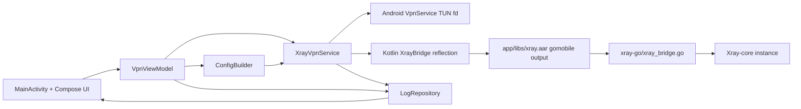

# Project Overview
XTLS Core Proxy is an MVP Android VPN client (minSdk 29 / Android 10+, targets API 36) that runs Xray-core in tun-only mode without
`tun2socks`, using an Android `VpnService` TUN interface passed into Xray through a gomobile-built
Go bridge (`app/libs/xray.aar`). The app accepts `vless://` URIs, `hysteria2://` / `hy2://` URIs, or raw
Xray JSON, normalizes runtime config to a single `tun` inbound, and manages tunnel lifecycle from a
Jetpack Compose UI.
It's meant to help people avoid the Internet blockings by the Russian Government and to access the free internet.

## Repository Structure

Single-module Gradle build (`:app`) + a separate Go module (`xray-go/`) wrapped via `gomobile bind`
into `app/libs/xray.aar`. Per-feature maintainer docs live under `docs/features/` — **check there before
grepping** for `tile/`, `i18n/`, `killswitch/`, etc.

```
.
├── app/
│   ├── build.gradle.kts            App module build config
│   ├── proguard-rules.pro
│   ├── build/                      Pre-generated Gradle output (gitignored)
│   ├── libs/
│   │   └── xray.aar                Generated by scripts/build-xray-aar.* (gitignored)
│   └── src/
│       ├── main/
│       │   ├── AndroidManifest.xml
│       │   ├── assets/             Committed geoip/geosite .dat files
│       │   ├── java/com/justme/xtls_core_proxy/
│       │   │   ├── MainActivity.kt
│       │   │   ├── XtlsApplication.kt
│       │   │   ├── add/            Paste/clipboard/subscription routing into Add UI
│       │   │   ├── apps/           Installed-app picker (kill-switch / split-tunnel)
│       │   │   ├── bridge/         XrayBridge — reflection facade over xray.aar
│       │   │   ├── config/         ConfigBuilder (secure-DNS chokepoint + inbound sanitization → docs/features), ProfileConfigCodec, Hysteria2ConfigCodec, JsonFormatter
│       │   │   ├── db/             Room: AppDatabase, Profile/Subscription DAOs
│       │   │   ├── geo/            GeoAssetPreparer (.dat files → app private dir)
│       │   │   ├── i18n/           LocalizedComponentActivity, SupportedLanguage
│       │   │   ├── killswitch/     Kill-on-foreground feature → docs/features/
│       │   │   ├── log/            LogRepository — sanitized state/log surface
│       │   │   ├── nametheft/      Name-theft warning, remote-gated "time bomb" → docs/features/
│       │   │   ├── settings/       Per-server + settings hub screens
│       │   │   ├── sideload/       Sideloading / "Keep Android Open" warning (launch trigger dormant) → docs/features/
│       │   │   ├── split/          Split-tunnel + SplitTunnelPlanner (whole-app tunneling → docs/features)
│       │   │   ├── state/          ActiveProfileRepository, VpnViewModel, PingState, PingTester
│       │   │   ├── subs/           Subscription fetch/parse/refresh
│       │   │   ├── tile/           QS Tile + TileClickDecision → docs/features/
│       │   │   ├── ui/             Reusable Compose components + theme
│       │   │   └── vpn/            XrayVpnService — VpnService + xray-core lifecycle; fail-closed startup → docs/features
│       │   └── res/
│       │       ├── drawable/, mipmap-*/  (ic_speedometer.xml — ping-test group header icon)
│       │       ├── values/         strings.xml (source of truth), colors, themes
│       │       ├── values-ru/      Russian strings.xml
│       │       └── xml/            backup_rules, data_extraction_rules, locales_config
│       ├── androidTest/java/...    Instrumented tests (mirrors main package structure)
│       └── test/java/...           JVM unit tests (mirrors main package structure)
├── docs/
│   ├── features/                   Per-feature maintainer reference — CHECK HERE FIRST
│   │   ├── boykisser-nag-screen.md
│   │   ├── boykisser-vpn.md
│   │   ├── dns-leak-enforcement.md  2B: ConfigBuilder secure-DNS chokepoint
│   │   ├── failclosed-startup.md    2A: protect(), whole-app tunneling, resilient startup
│   │   ├── hysteria2-support.md      Hysteria2 share links, codec, protocol-aware editor, FinalMask/Salamander, QUIC protect() (device-confirmed)
│   │   ├── kill-on-foreground.md
│   │   ├── localization.md
│   │   ├── name-theft-warning.md
│   │   ├── ping-test.md             Per-server / per-group handshake-latency probe → docs/features/
│   │   ├── qs-tile-vpn-toggle.md
│   │   └── sideloading-warning.md
│   ├── qa/                         QA scenarios
│   └── superpowers/                Working artifacts (plans/specs); specs not committed
├── gradle/
│   ├── libs.versions.toml          Version catalog — single source of dep versions
│   └── wrapper/                    Gradle wrapper jar + properties
├── scripts/
│   ├── build-xray-aar.bash         Linux/macOS gomobile build
│   ├── build-xray-aar.ps1          Windows PowerShell gomobile build
│   └── generate-agent-bundles.sh
├── xray-go/
│   ├── go.mod, go.sum
│   └── xray_bridge.go              Go entry points: StartXray, StopXray, RegisterProtector (protect() dial controller)
├── build.gradle.kts                Root Gradle config
├── settings.gradle.kts
├── gradle.properties
├── local.properties                SDK path (gitignored)
├── gradlew, gradlew.bat
├── AGENTS.md, CLAUDE.md, README.md
├── InspectionRuns                  IDE linter results - ignore unless user specifically asked for review
├── .gradle/, .kotlin/              Pre-generated Gradle / Kotlin caches (gitignored)
└── .idea/                          IDE state (gitignored; do not edit)
```

## Build & Development Commands
1. Install Go mobile prerequisites (from repo `README.md`).

```powershell
go install golang.org/x/mobile/cmd/gomobile@latest
gomobile init
```

2. Build the Xray AAR (Windows PowerShell).

```powershell
./scripts/build-xray-aar.ps1
```

3. Build the Xray AAR (Linux/macOS Bash).

```bash
./scripts/build-xray-aar.bash
```

4. Build Android debug APK (from repo `README.md`).

```powershell
./gradlew.bat :app:assembleDebug
```

5. Install and run debug build on a connected device.

```powershell
./gradlew.bat :app:installDebug
```

6. Run tests (unit + device/instrumentation).

```powershell
./gradlew.bat :app:testDebugUnitTest
./gradlew.bat :app:connectedDebugAndroidTest
```

7. Lint and full verification checks.

```powershell
./gradlew.bat :app:lintDebug
./gradlew.bat :app:check
```

8. Type-check/compile Kotlin without packaging.

```powershell
./gradlew.bat :app:compileDebugKotlin
```

9. Debug support (runtime logs).

```powershell
adb logcat
```

> TODO: Agree on log filters/tags for repeatable debugging commands.

10. Release build and deploy handoff.

```powershell
./gradlew.bat :app:bundleRelease
```

> TODO: Document the final deployment path (Play Console/internal distribution) and credentials flow.

## Code Style & Conventions
- Kotlin style is `official` (`gradle.properties`), with 4-space indentation and standard Kotlin/AGP
  defaults.
- Naming: `PascalCase` for classes/objects/composables, `camelCase` for methods/properties, and
  `UPPER_SNAKE_CASE` for constants.
- Package names stay lowercase (for example, `com.justme.xtls_core_proxy.*`).
- Keep VPN/runtime code explicit about failure states; surface user-visible errors through
  `LogRepository`/`VpnViewModel`.
- Linting uses Android Gradle lint tasks (`:app:lint*`); no dedicated `ktlint`/`detekt` config exists.
- **Compose `getString` from non-composable scopes:** inside callbacks/lambdas (e.g. button `onClick`),
  use `LocalResources.current.getString(...)` rather than `LocalContext.current.getString(...)`. The
  latter does not invalidate on Configuration changes and is flagged by lint as
  `LocalContextGetResourceValueCall`. The symbol lives at `androidx.compose.ui.platform.LocalResources`,
  **not** `androidx.compose.ui.res.LocalResources` — the package is easy to mis-guess.
- Commit messages currently have no enforced lint rule; use this template for consistency:

```text
<Short imperative summary>

Why (optional):
- <reason 1>
- <reason 2>
```

## Release Builds & Minification
- Release builds set `isMinifyEnabled = true` — R8 **shrinks and optimizes**. `-dontobfuscate` in
  `app/proguard-rules.pro` keeps names, but **do not rely on it**: write keep rules as if obfuscation
  were enabled, so they stay correct if it is ever removed.
- **Keep-rule rule — if your change reaches code R8's static analysis cannot see, add a matching
  `-keep` in `app/proguard-rules.pro`.** That includes: reflection (`Class.forName`, `Method.invoke`,
  `getDeclaredMethod`), JNI / `native` methods, dynamic class loading, and anything across the gomobile
  `xray.aar` bridge. R8 will otherwise strip or rename it, and the breakage shows up **only at runtime**
  (e.g. `bridge/XrayBridge.kt` → `xraybridge.**`, `go.**`). A green build does not prove safety — install
  the release APK and exercise the path.
- Release signing reads `key.properties` (gitignored) into `signingConfigs("release")`. The keystore key
  must be **RSA or EC**; Android's APK Signature Scheme v2/v3 rejects **EdDSA/Ed25519**. The R8
  `mapping.txt` (`app/build/outputs/mapping/release/`) deobfuscates production stack traces.

## Architecture Notes


The UI collects user input (VLESS URI or JSON), then `VpnViewModel` converts it into runtime JSON via
`ConfigBuilder` and starts `XrayVpnService`. The service creates a TUN interface, passes its fd into
`XrayBridge`, and starts/stops Xray-core through the Go mobile bridge. Connection state and sanitized
logs flow through `LogRepository` back to the UI.

Two cross-cutting fail-closed guarantees layer onto this flow (both are leak-proofing and reason
together — change them as a pair):

- **`ConfigBuilder` normalizes *every* config to a secure-DNS shape before it runs** — DoH-only
  resolver, all port-53 routed into Xray's DNS module, and the proxy server's own hostname forced
  through DoH (`ForceIP`). See [`docs/features/dns-leak-enforcement.md`](docs/features/dns-leak-enforcement.md).
- **Loop-avoidance is socket-level, not app-exclusion:** the Go bridge installs one global Xray dial
  controller that calls back into a reverse-bound **`Protector`** so Xray's own sockets are pulled out
  of the tun via `VpnService.protect()`, while the *whole app* is tunneled. `onStartCommand` is a
  total `StartCommandDecision` and returns `START_REDELIVER_INTENT` for crash/always-on recovery. See
  [`docs/features/failclosed-startup.md`](docs/features/failclosed-startup.md).

## Dormant / Temporarily-Disabled Features
These features are intentionally **switched off in the working tree**. Their code is **commented out
at the call sites only** — every definition is kept in place as dead code. Do **not** "clean up" the
resulting unused-symbol / unused-resource warnings by deleting the dead code, and do **not** re-enable
them without maintainer approval. Restore by uncommenting.

- **Promoted "Boykisser VPN" subscription — fully silenced.** The home banner (`MainActivity`,
  `showPromo = false`), the Subscriptions "Recommended" row (`subs/SubscriptionsActivity`), the nag
  screen (`subs/BoykisserInfoActivity`), and the inbound add path are all dormant. In
  `AndroidManifest.xml` the two `subs/BoykisserLinkActivity` `<intent-filter>`s are commented out, so
  the `bkvpn://add` **deep link** and the `https://boykiss3r.site/app/add` **App Link** no longer
  resolve; the `MainActivity.maybeAddBoykisserSub(...)` calls are commented out too. `PromotedSubscription`,
  `BoykisserCallback`, both Boykisser activities, and the `boykisser_*` strings remain intact. NOTE:
  `BoykisserLinkActivity` is still declared `android:exported="true"` but now has no intent-filters, so
  nothing can launch it implicitly. See `docs/features/boykisser-vpn.md` and `docs/features/boykisser-nag-screen.md`.
- **Sideload "Keep Android Open" launch popup — disabled.** Gated off behind
  `MainActivity.SIDELOAD_WARNING_LAUNCH_ENABLED = false`. The dialog, `SideloadWarningRepository`, the
  strings, and the on-demand Settings-hub entry all remain; flip the flag to restore the once-per-version
  launch prompt. See `docs/features/sideloading-warning.md`.

Note: `boykiss3r.site` / `somenewsteps.space` are still **live** as the name-theft warning's status-probe
hosts (`nametheft/NameTheftWarning.kt`) — that is a different, active path; only the promo *add* routes on
those domains are dormant.

## Testing Strategy
- Unit tests: JUnit4 tests under `app/src/test` (for example, `ConfigBuilderTest`) validate runtime
  config generation and input rejection logic.
- Integration/device tests: Android instrumented tests under `app/src/androidTest` run with
  `AndroidJUnit4` on connected hardware/emulator.
- Local test commands:

```powershell
./gradlew.bat :app:testDebugUnitTest
./gradlew.bat :app:connectedDebugAndroidTest
./gradlew.bat :app:check
```

- CI status: no repository CI workflow is present.
> TODO: Add CI that runs `:app:lintDebug`, `:app:testDebugUnitTest`, and selected device tests.

## Security & Compliance
- Never commit secrets or personal endpoints; treat pasted `vless://` links, UUIDs, and REALITY keys as
  sensitive.
- `LogRepository` redacts UUID/publicKey/shortId patterns before displaying logs.
- `ConfigBuilder` is the single chokepoint that enforces tun-only behavior by **sanitizing any
  config's inbounds into the canonical `tun` inbound** (it no longer *rejects* `socks`/`http` — it
  rewrites them, so real-world panel configs import) and **enforces a fail-closed secure-DNS posture**
  on every config (DoH-only resolver, port-53 → `dns-out`, `ForceIP` server-name bootstrap). See
  `docs/features/dns-leak-enforcement.md`.
- Loop-avoidance is socket-level via `VpnService.protect()` (a global Xray dial controller in the Go
  bridge), not app-exclusion, so the whole app is tunneled and only Xray's own sockets bypass — no
  app traffic leaks around the tun. See `docs/features/failclosed-startup.md`.
- `.gitignore` already excludes local/dev artifacts (`local.properties`, generated `app/libs/*.aar`,
  geo data assets, and `xray-go/go.sum`).
- Dependency intake is dynamic in AAR scripts (`go get ...@main`, `go get ...@latest`).
> TODO: Add automated dependency and vulnerability scanning policy for Gradle and Go modules.
- License/compliance metadata is incomplete.
> TODO: Add a project `LICENSE` and third-party notices for Xray-core and transitive dependencies.

## Agent Guardrails
- Never edit or commit generated/local artifacts: `app/libs/*.aar`, geo data assets, `local.properties`,
  and machine-local IDE state unless explicitly requested.
- When searching or indexing the codebase, run a subagent with specifically defined File Searcher mode.
- Treat `.idea/` changes as opt-in; require maintainer confirmation before modifying IDE configs.
- Require human review for changes to
  `app/src/main/java/com/justme/xtls_core_proxy/vpn/`,
  `app/src/main/java/com/justme/xtls_core_proxy/bridge/`, `xray-go/`, and build scripts before merge.
- Run heavyweight commands serially (one `gradlew` or one `gomobile bind` at a time) to avoid resource
  contention and inconsistent outputs.
- When nested `AGENTS.md` files exist, apply root instructions first, then append nested instructions
  from root toward the working directory.
- When finishing a **full feature** (not a small task or one-off fix), run a **Release** build
  (`./gradlew.bat :app:assembleRelease`) before finishing/merging the branch — the stricter release
  pipeline (R8 minification, lint-vital, and signing) surfaces problems that debug builds hide, and
  catching them early beats discovering them at release time. For small, low-risk changes a debug build
  plus `:app:testDebugUnitTest` is enough.
- **Documentation is part of the branch lifecycle — when finishing a branch / merging into `main`,
  update the maintainer docs to match the merged behavior.** Specifically: (1) add a
  `docs/features/<feature>.md` for each new feature; (2) **correct any existing `docs/features/` doc
  whose described behavior the change altered** — a doc that drifts from code is *worse* than no doc,
  because it reads as authoritative and is wrong (e.g. a maintainer could "re-fix" an already-fixed
  bug); and (3) update this `AGENTS.md` where the change invalidated it — the `docs/features/` index,
  the Repository Structure tree, Architecture Notes, Security & Compliance, and Extensibility Hooks.
  Do this **before** the merge, not as a later chore.
- Do not perform deploy/release publication steps without explicit maintainer approval.

## Extensibility Hooks
- Runtime config extension point:
  `app/src/main/java/com/justme/xtls_core_proxy/config/ConfigBuilder.kt`
  (`fromVlessUri`, `fromHysteria2Uri`, `fromJson`, outbound/routing builders;
  `toPingTestConfig` — dialer-only probe config: full runtime config minus the tun inbound) and the
  per-protocol codecs `config/ProfileConfigCodec.kt` (VLESS URI/JSON, `ConfigKind` detection) and
  `config/Hysteria2ConfigCodec.kt` (Hysteria2 model, URI parse, Xray JSON build/extract/merge).
- VPN lifecycle extension point:
  `app/src/main/java/com/justme/xtls_core_proxy/vpn/XrayVpnService.kt`
  for TUN setup, DNS/routes, and foreground notification behavior. `onStartCommand` routing is a pure
  `vpn/StartCommandDecision.kt`; split-tunnel / whole-app self-handling is a pure
  `split/SplitTunnelPlanner.kt` — extend those rather than inlining new `when` branches in the service.
- Bridge extension points:
  - Kotlin reflection candidates in
    `app/src/main/java/com/justme/xtls_core_proxy/bridge/XrayBridge.kt` (`classNames` list).
  - Go lifecycle surface in `xray-go/xray_bridge.go` (`StartXray`, `StopXray`, `RegisterProtector` —
    the `protect()` dial controller; `MeasureLatency` — throwaway-instance latency probe, never
    touches `mu`/`instance`; the `Protector` reverse-binding interface is keep-ruled via
    `-keep class xraybridge.**`).
  - Kotlin reflection surface in `bridge/XrayBridge.kt`: `startXray`, `stopXray`, `registerProtector`,
    `measureLatency` (3-param: configJson, targetUrl, timeoutMs).
- Environment variables and script knobs:

| Variable | Where used | Purpose |
| --- | --- | --- |
| `OUTPUT` | `scripts/build-xray-aar.bash` | Override output AAR path (default `app/libs/xray.aar`). |
| `ANDROID_API` | `scripts/build-xray-aar.bash` | Override gomobile Android API level (default `26`). |
| `xray.tun.fd` | `xray-go/xray_bridge.go` | Pass TUN file descriptor into Xray-core runtime. |
| `XRAY_TUN_FD` | `xray-go/xray_bridge.go` | Alternate env key for TUN file descriptor. |
| `GONOSUMDB` | build scripts | Bypass checksum DB for Xray-core module path quirk. |

> TODO: Add explicit feature flags if runtime behavior needs environment-based toggles.

# IMPORTANT NOTICE
**Always output tool calls in the official MCP JSON format. Do not provide a text summary of the call before executing it.**
**DO NOT** use backslashes for absolute paths in tool calls; always use OS-agnostic forward slashed paths (for example, `/Users/User/XTLS_CORE_PROXY/app/src/main/java/...` instead of `C:\Users\user\XTLS_CORE_PROXY\app\src\main\java\...`).
When you list a directory, MAKE SURE you leave a trailing slash at the end of the path to indicate it's a directory, and not a file. For example, `list_dir("app/src/main/java/")` instead of `list_dir("app/src/main/java")`.

## Further Reading
- [README](README.md)
- [Geo files note](app/src/main/assets/WHERE_TO_GET_GEOFILES.md)
- [PowerShell AAR build script](scripts/build-xray-aar.ps1)
- [Bash AAR build script](scripts/build-xray-aar.bash)
- [Go bridge module](xray-go/xray_bridge.go)
- [Android runtime config builder](app/src/main/java/com/justme/xtls_core_proxy/config/ConfigBuilder.kt)
