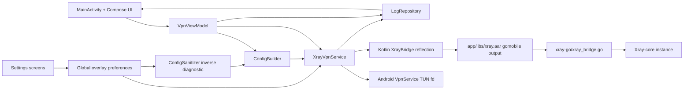

# Project Overview
XTLS Core Proxy is an MVP Android VPN client (minSdk 29 / Android 10+, targets API 36) that runs Xray-core in tun-only mode without
`tun2socks`, using an Android `VpnService` TUN interface passed into Xray through a gomobile-built
Go bridge (`app/libs/xray.aar`). The app accepts `vless://` URIs, `hysteria2://` / `hy2://` URIs, or raw
Xray JSON, normalizes runtime config to a single `tun` inbound, and manages tunnel lifecycle from a
Jetpack Compose UI.
It's meant to help people avoid the Internet blockings by the Russian Government and to access the free internet.

## Repository Structure

Single-module Gradle build (`:app`) + a separate Go module (`xray-go/`) wrapped via `gomobile bind`
into `app/libs/xray.aar`. Per-feature maintainer docs live under `docs/features/` — **check there before
grepping** for `tile/`, `i18n/`, `killswitch/`, etc.

```
.
├── .github/
│   └── workflows/build.yml     CI — AAR build + assembleDebug + unit tests + lintDebug (see Testing Strategy)
├── app/
│   ├── build.gradle.kts            App module build config
│   ├── proguard-rules.pro
│   ├── build/                      Pre-generated Gradle output (gitignored)
│   ├── libs/
│   │   └── xray.aar                Generated by scripts/build-xray-aar.* (gitignored)
│   └── src/
│       ├── main/
│       │   ├── AndroidManifest.xml
│       │   ├── assets/             Tracked: WHERE_TO_GET_GEOFILES.md, boykisser-assetlinks.json. The geoip*/geosite* .dat files are gitignored — obtain locally (see the .md)
│       │   ├── java/com/justme/xtls_core_proxy/
│       │   │   ├── MainActivity.kt
│       │   │   ├── ProfileActionsDialog.kt  Long-press island menu (BasicAlertDialog) → docs/features/profile-actions-menu.md
│       │   │   ├── XtlsApplication.kt
│       │   │   ├── add/            Paste/clipboard/subscription routing into Add UI
│       │   │   ├── apps/           Installed-app picker (kill-switch / split-tunnel)
│       │   │   ├── bridge/         XrayBridge — reflection facade over xray.aar
│       │   │   ├── config/         ConfigBuilder (mandatory normalization + fragmentation→mux→DNS→routing→core overlays), ConfigSanitizer (read-only inverse diagnostic), overlay models/preferences, LogSettings, profile codecs/share links, JsonFormatter → docs/features/
│       │   │   ├── db/             Room: AppDatabase, Profile/Subscription DAOs
│       │   │   ├── failover/       Auto-failover → docs/features/auto-failover.md: FailoverPreferences (+ the timeout<interval coerce), HealthProbe/Http204HealthProbe (204 through the LIVE tun, to the fixed ConfigBuilder.HEALTH_PROBE_TARGET_URL that applyRouting carves through the proxy — NOT the editable Ping Test target), NetworkAvailability (offline guard), TunnelHealthMonitor (terminal-after-fire poll loop), FailoverDecision (nextCandidate + sliding thrash cap), FailoverPoolResolver (SPEC 2 SEAM, shared with connect-to-fastest), FailoverSettingsActivity + FailoverSettingsPersistDecision, FastestConnectRunner/FastestPick (the delivery-time re-gate takes an injected canConnect closure, wired to state/connectAction — BLACKHOLED still delivers). The Reconnect affordance a give-up offers lives in state/ (ConnectAction + ReconnectFlow), not here
│       │   │   ├── geo/            GeoAssetPreparer (.dat files → app private dir)
│       │   │   ├── i18n/           LocalizedComponentActivity, SupportedLanguage
│       │   │   ├── killswitch/     Kill-on-foreground feature → docs/features/
│       │   │   ├── log/            LogRepository (sanitized state/log surface; VpnConnectionState incl. BLACKHOLED; also publishes `giveUpLine` — which of the THREE give-up outcomes a session is in, incl. the UNPROTECTED one that rides ERROR — and `userStopGeneration`, the tile/notification Stop signal ReconnectFlow tells apart from its own teardown), VpnConnectionLabels (GiveUpOngoingLine + vpnConnectionStateLabelRes — lives HERE, not in vpn/, so home and tile can share one mapping without a log→vpn import), LogsActivity (screen → docs/features), XrayCoreLogTailer (file-tail → LogRepository), LogPreferences (level + buffer prefs)
│       │   │   ├── nametheft/      Name-theft warning, remote-gated "time bomb" → docs/features/
│       │   │   ├── privacy/        Device identity (HWID): settings repo + pure header/UA/rejection/hint logic + HwidSettingsActivity → docs/features/hwid-device-identity.md
│       │   │   ├── settings/       Per-server + settings hub screens, including Fragmentation, Mux, DNS, Routing, XRAY, Config Sanitization, and Ping Test destinations → docs/features/ (the Tunnel → Auto-failover row opens failover/FailoverSettingsActivity); DebugUnrestrictedAddProfileActivity (debug-only unrestricted profile adder → docs/features/debug-tools.md)
│       │   │   ├── sideload/       Sideloading / "Keep Android Open" warning (launch trigger dormant) → docs/features/
│       │   │   ├── split/          Split-tunnel + SplitTunnelPlanner (whole-app tunneling → docs/features)
│       │   │   ├── state/          ActiveProfileRepository, VpnViewModel (+ the connect gate: ConnectAction/connectAction/connectLabelRes/connectEnabled — three-valued, replaced the old boolean canConnect), ReconnectFlow (stop→settle→start→verify for RECONNECT; first-request-wins in-flight guard; abandons on `LogRepository.userStopGeneration` so a tile/notification Stop cannot be mistaken for its own settle — the abort wins every tie by re-reading the generation inside the state branch, since both signals are replaying StateFlows), ConnectErrorRetention (whether a CONNECTING transition wipes `error`: a refusal survives the winning request's own CONNECTING, exactly once), PingState, PingTester (constants + backstopFor holder), PingCoordinator (stable admission owner: cross-run dedup + fixed native-slot ceiling + bounded-orphan probeWithBackstop), AutoPingLatch (process-scoped once-per-launch latch), PingPreferences (fresh per-probe settings)
│       │   │   ├── subs/           Subscription fetch/parse/refresh; SubscriptionRefreshCoordinator loads device-identity settings and augments fetch errors with HWID/UA guidance; PromoGate + PromoGateRepository (remote-gated promo — see Dormant Features), Boykisser* promo/link activities
│       │   │   ├── tile/           QS Tile + TileClickDecision → docs/features/
│       │   │   ├── ui/             Reusable Compose components + theme (theme/: AppearanceRepository, ThemeMode/resolveScheme/useDynamic, Theme.kt brand palette + True Dark → docs/features/app-appearance.md); SettingsComponents (SettingsSectionHeader/SettingsRow → docs/features/settings-hub.md)
│       │   │   └── vpn/            XrayVpnService (VpnService + xray-core lifecycle; fail-closed startup → docs/features; also the failover rotation/give-up/blackhole wiring), StartCommandDecision, SessionLifecycleDecision (pure kill/revive/ROTATE transition + give-up rules), VpnNotifications (ids 1101/1103/1104/1105/1106 + their channels; 1106 = kill-switch-not-applied, posted on the EXISTING exposure channel and retracted by killTunnel/stopVpn)
│       │   └── res/
│       │       ├── drawable/, mipmap-*/  (ic_speedometer.xml — ping-test group header icon; ic_bolt.xml — connect-to-fastest)
│       │       ├── values/         strings.xml (source of truth), colors, themes
│       │       ├── values-ru/      Russian strings.xml
│       │       └── xml/            backup_rules, data_extraction_rules, locales_config, network_security_config (LOAD-BEARING — the one-host cleartext carve-out the health probe needs; see Architecture Notes)
│       ├── androidTest/java/...    Instrumented tests (mirrors main package structure)
│       └── test/java/...           JVM unit tests (mirrors main package structure)
├── docs/
│   ├── features/                   Per-feature maintainer reference — CHECK HERE FIRST
│   │   ├── app-appearance.md        Theme modes (System/Light/Dark/True Dark) + Material You; live repo recompose; Theme.kt inline-SDK-guard gotcha
│   │   ├── auto-connect-boot.md     Stateless explainer + deep-link to OS Always-on VPN (no boot receiver, no local state)
│   │   ├── auto-failover.md        Tunnel health watchdog, rotation engine, the rotation bridge TUN, three-outcome fail-closed give-up (blackhole TUN), BLACKHOLED state, Reconnect (ConnectAction + ReconnectFlow), "disconnect now, stop if re-arm fails", connect-to-fastest
│   │   ├── boykisser-nag-screen.md
│   │   ├── boykisser-vpn.md
│   │   ├── config-sanitization.md  Read-only inverse diagnostic over the effective runtime pipeline
│   │   ├── debug-tools.md          Debug-only unrestricted profile adder (reaches fail-closed UI; three release guards)
│   │   ├── dns.md                  Global secure-resolver + query-strategy overlay
│   │   ├── dns-leak-enforcement.md  2B: ConfigBuilder secure-DNS chokepoint
│   │   ├── failclosed-startup.md    2A: protect(), whole-app tunneling, resilient startup
│   │   ├── fragmentation.md         Global anti-DPI sockopt.fragment overlay (TCP-only; xhttp-over-h3 skipped); ConfigBuilder merge + XrayVpnService session capture
│   │   ├── hysteria2-support.md      Hysteria2 share links, codec, toShareLink, protocol-aware editor, FinalMask/Salamander, QUIC protect() (device-confirmed)
│   │   ├── hwid-device-identity.md   Android-Happ parity HWID + device headers on subscription fetch; Privacy settings; pure builders + coordinator chokepoint
│   │   ├── kill-on-foreground.md
│   │   ├── localization.md
│   │   ├── logs-screen.md           File+tail log pipeline, session-stable level, redaction boundary
│   │   ├── mux.md                   Global Mux.Cool VLESS overlay and applicability rules
│   │   ├── name-theft-warning.md
│   │   ├── ping-test.md             Per-server/group probe, fresh preferences, derived backstop, stable PingCoordinator (cross-run dedup + bounded native cap), process-scoped auto-ping latch
│   │   ├── profile-actions-menu.md   Long-press island menu (BasicAlertDialog), share-link reconstruction, clipboard sensitivity
│   │   ├── qs-tile-vpn-toggle.md
│   │   ├── routing-rules.md         Geo/LAN/ads routing overlay and fail-closed availability handling
│   │   ├── settings-hub.md          Sectioned hub, SettingsSectionHeader/SettingsRow, BuildConfig.DEBUG placeholders
│   │   ├── sideloading-warning.md
│   │   └── xray-settings.md         MTU/IPv6/sniffing/domain strategy overlay + linked core version
│   ├── play-policy-declarations.md Play Console policy declaration answers
│   ├── qa/                         QA scenarios (incl. auto-failover-qa.md — the hardware-only failover matrix)
│   └── superpowers/                Working artifacts (plans/specs); specs not committed
├── gradle/
│   ├── libs.versions.toml          Version catalog — single source of dep versions
│   └── wrapper/                    Gradle wrapper jar + properties
├── scripts/
│   ├── build-xray-aar.bash         Linux/macOS gomobile build
│   ├── build-xray-aar.ps1          Windows PowerShell gomobile build
│   └── generate-agent-bundles.sh
├── xray-go/
│   ├── go.mod (tracked), go.sum (gitignored)
│   └── xray_bridge.go              Go entry points: StartXray/StopXray, RegisterProtector, MeasureLatency, XrayVersion
├── build.gradle.kts                Root Gradle config
├── settings.gradle.kts
├── gradle.properties
├── local.properties                SDK path (gitignored)
├── gradlew, gradlew.bat
├── AGENTS.md, CLAUDE.md, README.md
├── LICENSE                         GNU AGPL v3
├── InspectionRuns                  IDE linter results (untracked, machine-local) - ignore unless user specifically asked for review
├── .gradle/, .kotlin/              Pre-generated Gradle / Kotlin caches (gitignored)
└── .idea/                          IDE state (gitignored; do not edit)
```

Known `docs/features/` gaps (no doc yet — verify these areas in code): promo gating
(`subs/PromoGate`), general `subs/` subscription management, `add/` paste/clipboard routing,
the per-server editor (`settings/` hub is now covered by `settings-hub.md`), the `db/` Room layer,
`geo/GeoAssetPreparer`, a dedicated split-tunnel doc (whole-app tunneling is covered by
`failclosed-startup.md`), and `vpn/VpnNotifications`.

## Build & Development Commands
1. Install Go mobile prerequisites (from repo `README.md`).

```powershell
go install golang.org/x/mobile/cmd/gomobile@latest
gomobile init
```

2. Build the Xray AAR (Windows PowerShell).

```powershell
./scripts/build-xray-aar.ps1
```

3. Build the Xray AAR (Linux/macOS Bash).

```bash
./scripts/build-xray-aar.bash
```

4. Build Android debug APK (from repo `README.md`).

```powershell
./gradlew.bat :app:assembleDebug
```

5. Install and run debug build on a connected device.

```powershell
./gradlew.bat :app:installDebug
```

6. Run tests (unit + device/instrumentation).

```powershell
./gradlew.bat :app:testDebugUnitTest
./gradlew.bat :app:connectedDebugAndroidTest
```

7. Lint and full verification checks.

```powershell
./gradlew.bat :app:lintDebug
./gradlew.bat :app:check
```

8. Type-check/compile Kotlin without packaging.

```powershell
./gradlew.bat :app:compileDebugKotlin
```

9. Debug support (runtime logs).

```powershell
adb logcat
```

> TODO: Agree on log filters/tags for repeatable debugging commands.

10. Release build and deploy handoff.

```powershell
./gradlew.bat :app:bundleRelease
```

> TODO: Document the final deployment path (Play Console/internal distribution) and credentials flow.

## Code Style & Conventions
- Kotlin style is `official` (`gradle.properties`), with 4-space indentation and standard Kotlin/AGP
  defaults.
- Naming: `PascalCase` for classes/objects/composables, `camelCase` for methods/properties, and
  `UPPER_SNAKE_CASE` for constants.
- Package names stay lowercase (for example, `com.justme.xtls_core_proxy.*`).
- Keep VPN/runtime code explicit about failure states; surface user-visible errors through
  `LogRepository`/`VpnViewModel`.
- Linting uses Android Gradle lint tasks (`:app:lint*`); no dedicated `ktlint`/`detekt` config exists.
- **Compose `getString` from non-composable scopes:** inside callbacks/lambdas (e.g. button `onClick`),
  use `LocalResources.current.getString(...)` rather than `LocalContext.current.getString(...)`. The
  latter does not invalidate on Configuration changes and is flagged by lint as
  `LocalContextGetResourceValueCall`. The symbol lives at `androidx.compose.ui.platform.LocalResources`,
  **not** `androidx.compose.ui.res.LocalResources` — the package is easy to mis-guess.
- Commit messages currently have no enforced lint rule; use this template for consistency:

```text
<Short imperative summary>

Why (optional):
- <reason 1>
- <reason 2>
```

## Release Builds & Minification
- Release builds set `isMinifyEnabled = true` **and** `isShrinkResources = true` — R8 **shrinks,
  optimizes, and obfuscates**: the `-dontobfuscate` line in `app/proguard-rules.pro` is **commented
  out** (deliberately, to hinder code injection), so release names ARE renamed. Write keep rules as
  `-keep` (not merely no-obfuscate) — they must hold under obfuscation, because obfuscation is on.
- **Keep-rule rule — if your change reaches code R8's static analysis cannot see, add a matching
  `-keep` in `app/proguard-rules.pro`.** That includes: reflection (`Class.forName`, `Method.invoke`,
  `getDeclaredMethod`), JNI / `native` methods, dynamic class loading, and anything across the gomobile
  `xray.aar` bridge. R8 will otherwise strip or rename it, and the breakage shows up **only at runtime**
  (e.g. `bridge/XrayBridge.kt` → `xraybridge.**`, `go.**`). A green build does not prove safety — install
  the release APK and exercise the path.
- Release signing reads `key.properties` (gitignored) into `signingConfigs("release")`. The keystore key
  must be **RSA or EC**; Android's APK Signature Scheme v2/v3 rejects **EdDSA/Ed25519**. The R8
  `mapping.txt` (`app/build/outputs/mapping/release/`) deobfuscates production stack traces.
- `assembleRelease` emits per-ABI split APKs (arm64-v8a, armeabi-v7a) plus a universal fallback,
  renamed to `boykisser-<abi>-<buildType>-<version>.apk`, and a `.sha256sum` file next to each
  release APK (`sha256ReleaseApks` task). The AAB path (`bundleRelease`) splits per-ABI itself but
  keeps every locale in the base APK (`language { enableSplit = false }` — required by the in-app
  language picker).

## Architecture Notes

```mermaid
flowchart LR
    UI[MainActivity + Compose UI] --> VM[VpnViewModel]
    SETTINGS[Settings screens] --> PREFS[Global overlay preferences]
    PREFS --> SVC
    PREFS --> SAN[ConfigSanitizer inverse diagnostic]
    VM --> CFG[ConfigBuilder]
    VM --> SVC[XrayVpnService]
    CFG --> SVC
    SAN --> CFG
    SVC --> TUN[Android VpnService TUN fd]
    SVC --> KBRIDGE[Kotlin XrayBridge reflection]
    KBRIDGE --> AAR[app/libs/xray.aar gomobile output]
    AAR --> GOBRIDGE[xray-go/xray_bridge.go]
    GOBRIDGE --> XRAY[Xray-core instance]
    SVC --> LOG[LogRepository]
    VM --> LOG
    LOG --> UI
```

The UI collects user input (a `vless://` or `hysteria2://`/`hy2://` share link, or raw Xray JSON), then `VpnViewModel` converts it into runtime JSON via
`ConfigBuilder` and starts `XrayVpnService`. The service creates a TUN interface, passes its fd into
`XrayBridge`, and starts/stops Xray-core through the Go mobile bridge. Connection state and sanitized
logs flow through `LogRepository` back to the UI.

Global connection settings are persisted independently of profiles; the six overlay settings screens
(DNS, Mux, Routing, XRAY, Fragmentation, Ping) **autosave** — each persists on change with no Save
button, and the value is still captured into the session snapshot only at the next full connection.
`XrayVpnService` captures fragmentation, Mux, DNS, routing, and XRAY-core preferences once per full
connection and reuses that immutable `TuningSettings` snapshot for kill-switch revives. `ConfigBuilder` applies the snapshot in
the load-bearing order `applyFragmentation → applyMux → applyDns → applyRouting →
applyCoreSettings`; DNS must precede routing so the `BLOCKED_ONLY` DoH guard sees the effective
resolver, and core settings run last for IPv6/query-strategy and forced-sniffing resolution.
`ConfigSanitizer` runs the same pipeline without saving or connecting, then presents an inverse,
policy-level explanation of its effective result. See
[`docs/features/config-sanitization.md`](docs/features/config-sanitization.md).

Ping probes are deliberately outside the connection snapshot. `VpnViewModel` loads
`PingPreferences` fresh when accepting each probe and delegates to one stable `PingCoordinator`
(`val`, never swapped): per-run concurrency is passed into `runGroup`, while the coordinator's
cross-run `inFlight` de-dup set and its fixed native-slot ceiling (`= PingPreferences.CONCURRENCY_MAX`)
persist across concurrency changes; `probeWithBackstop` bounds orphaned JNI probes by holding a native
slot until the uninterruptible call returns, and the Kotlin wall-clock backstop (derived from the Go
timeout) abandons only the *await*, not the slot. Optional auto-ping probes the full server set from
the atomic flat `profiles` query (`VpnViewModel.autoPingProfiles`, **not** the subscription-grouped
view, which raced the separate `subscriptions` load) and is consumed once per app launch via the
process-scoped `AutoPingLatch` (an `object` whose atomic consumed bit re-arms only on process death). See
[`docs/features/ping-test.md`](docs/features/ping-test.md).

**Auto-failover is a third, live-observed settings rail** — neither session-captured like
`TuningSettings` nor per-probe like `PingPreferences`. `XrayVpnService` **seeds**
`FailoverPreferences.load(...)` on connect (load-bearing: the process-global StateFlow starts at
`DEFAULT`, so an observer-only wiring would leave failover silently dead on every process-fresh connect
path — process death, always-on restart, a first-launch tile connect) and then observes
`FailoverPreferences.state` for the session. While `CONNECTED`, a `TunnelHealthMonitor` probes the
**live tunnel** (a plain-Kotlin **cleartext** HTTP 204 through the tun, which is only legal because
`res/xml/network_security_config.xml` carves out `HEALTH_PROBE_HOST` and `<application>` wires it in
via `android:networkSecurityConfig`. That chain is load-bearing: `HttpURLConnection` is governed by
`NetworkSecurityPolicy`, and at `targetSdk = 36` cleartext is denied by default, so breaking any link
— renaming the host, deleting the file, dropping the attribute — fails **every** probe, which the
watchdog answers with a rotation storm over healthy servers. `HealthProbeSchemeTest` couples all
three. Cleartext is kept deliberately over `https://`: with no tunnel the probe is on the clear
network, where a plaintext `/generate_204` is indistinguishable from Android's own captive-portal
check while a TLS handshake is not. The Ping Test target is also `http://` but for an unrelated
reason and needs no exemption — the Go bridge dials it over raw native sockets — *not*
`MeasureLatency`, whose throwaway
instance is `protect()`'d out of the tun) and, after N consecutive failures, `rotateTunnel` reserves
`CONNECTED → ROTATING` and swaps to a sibling from `FailoverPoolResolver`. Rotation is a peer of the
kill-switch's kill/revive and shares its epoch/lock discipline and its screen receiver. See
[`docs/features/auto-failover.md`](docs/features/auto-failover.md).

Two cross-cutting fail-closed guarantees layer onto this flow (both are leak-proofing and reason
together — change them as a pair), plus a third normalization on the same chokepoint:

- **`ConfigBuilder` normalizes *every* config to a secure-DNS shape before it runs** — DoH-only
  resolver, all port-53 routed into Xray's DNS module, and the proxy server's own hostname forced
  through DoH (`ForceIP`). See [`docs/features/dns-leak-enforcement.md`](docs/features/dns-leak-enforcement.md).
- **Loop-avoidance is socket-level, not app-exclusion:** the Go bridge installs one global Xray dial
  controller that calls back into a reverse-bound **`Protector`** so Xray's own sockets are pulled out
  of the tun via `VpnService.protect()`, while the *whole app* is tunneled. `onStartCommand` is a
  total `StartCommandDecision` and returns `START_REDELIVER_INTENT` for crash/always-on recovery. See
  [`docs/features/failclosed-startup.md`](docs/features/failclosed-startup.md).
- **`ConfigBuilder.buildRuntimeConfig` also forces the `log` object** on every config (level +
  app-private error-file path via `LogSettings`), overwriting rather than merging so a pasted config
  can't redirect Xray's own log writes elsewhere. See
  [`docs/features/logs-screen.md`](docs/features/logs-screen.md).
- **Global settings compose after those mandatory normalizations; they do not replace them, and three
  fail-closed backstops sit on the same runtime chokepoint.** (1) Routing's derived
  `effectiveRoutingMode` degrades an unsupported `BLOCKED_ONLY` country to proxy-all before a direct
  catch-all can be emitted. (2) XRAY IPv6-off keeps IPv6 captured by the Android VPN and inserts an
  in-tunnel `::/0 → block` rule (forcing `queryStrategy=UseIPv4`). (3) `applyDns` IPv6-off degrades a
  v6-only **custom** DoH resolver to the Cloudflare v4 preset so it can't strand DNS — all four presets
  are IPv4, so only a custom resolver can ever fire it. See
  [`docs/features/routing-rules.md`](docs/features/routing-rules.md),
  [`docs/features/xray-settings.md`](docs/features/xray-settings.md), and
  [`docs/features/dns-leak-enforcement.md`](docs/features/dns-leak-enforcement.md).
- **Auto-failover's give-up is a fourth fail-closed guarantee, at the *runtime* layer rather than the
  config layer.** When no server can be brought up, the service re-establishes a **blackhole TUN** —
  same routes, addresses, DNS servers and split-tunnel plan as a real bring-up, but no protector and no
  Xray, so packets enter an fd nobody reads and are dropped. "Just keep the dead tunnel up" is NOT
  equivalent: the all-servers-dead path tears the TUN down *before* the final bring-up fails, so
  exposure would depend on where bring-up died. The three outcomes
  (`CONTAINED_BY_LIVE_TUNNEL` / `CONTAINED_BY_BLACKHOLE` / `UNPROTECTED`) must never share one
  user-facing message, and the uncontained one must never inherit containment copy. See
  [`docs/features/auto-failover.md`](docs/features/auto-failover.md).
- **The same unread TUN also bridges every rotation.** A rotation tears the tunnel down under `lock`
  and then builds the next config off-lock for seconds, so `rotateTunnel` opens a
  **rotation bridge** over that window and `bringUpTunnel` releases it immediately before
  `establish()` — release-then-establish, adjacent, no I/O between. It lives in its own field
  (`rotationBridgeInterface`), **never** in `tunInterface`: that field means *the live, still-proxying
  tunnel*, and a bridge stored there would make a give-up landing in the gap report
  `CONTAINED_BY_LIVE_TUNNEL`. A give-up **adopts** the bridge instead of building a second TUN, and
  every other exit from the gap must release it — a leaked bridge is a leaked VPN interface. See
  [`docs/features/auto-failover.md`](docs/features/auto-failover.md).

## Dormant / Temporarily-Disabled Features
These feature **entry points** are intentionally switched off in the working tree. The disabling is
**at the call sites only** (commented-out manifest filters / a `false` flag) — every definition is
kept in place, some as dead code. Do **not** "clean up" the resulting unused-symbol /
unused-resource warnings by deleting the dead code, and do **not** re-enable them without maintainer
approval. Restore by uncommenting / flipping the flag.

- **Promoted "Boykisser VPN" subscription — deep links dormant; in-app promo LIVE but remote-gated.**
  Only the manifest entry points are switched off: in `AndroidManifest.xml` the two
  `subs/BoykisserLinkActivity` `<intent-filter>`s are commented out, so the `bkvpn://add` **deep
  link** and the `https://boykiss3r.site/app/add` **App Link** no longer resolve
  (`BoykisserLinkActivity` stays `android:exported="true"` but with no intent-filters nothing can
  launch it implicitly). Everything else is active in code:
  - The home banner (`MainActivity`) and the Subscriptions promo row (`subs/SubscriptionsActivity`)
    both render when `PromoGate.resolve(...) == true && !PromotedSubscription.hasValidSubscription(...)`
    — **not** a hard-coded `showPromo = false`.
  - `subs/PromoGate` is a remote kill-switch (a deliberate behavioral clone of the name-theft gate —
    the duplication is intentional, do not extract a shared helper): it probes `/dowepromote` on
    `boykiss3r.site` then `somenewsteps.space` (HTTP 418 = show now, 409 = disarm, 451 = re-arm),
    persists the disarm lease via `subs/PromoGateRepository` (`xray_prefs` / `promote_disarmed`),
    and on an inconclusive probe falls back to a device-local date gate (shows on/after 2026-08-01).
  - The nag screen (`subs/BoykisserInfoActivity`) is reachable from the banner and the promo row, and
    the inbound add path is live: its paste-and-submit hands an approved URL to
    `MainActivity.maybeAddBoykisserSub(...)`, which is called (not commented out) from `onCreate` and
    `onNewIntent` and re-validates the approved-domain allowlist because the extra is forgeable.

  `docs/features/boykisser-vpn.md` / `docs/features/boykisser-nag-screen.md` pre-date the PromoGate
  re-enable — trust this section over them until they are refreshed.
- **Sideload "Keep Android Open" launch popup — disabled.** Gated off behind
  `MainActivity.SIDELOAD_WARNING_LAUNCH_ENABLED = false`. The dialog, `SideloadWarningRepository`, the
  strings, and the on-demand Settings-hub entry all remain; flip the flag to restore the once-per-version
  launch prompt. See `docs/features/sideloading-warning.md`.

Note: `boykiss3r.site` / `somenewsteps.space` are **live** for two active probe paths — the name-theft
warning's status probe (`nametheft/NameTheftWarning.kt`) and the promo gate's `/dowepromote` probe
(`subs/PromoGate.kt`). Only the promo *add* deep-link routes on those domains are dormant.

## Testing Strategy
- Unit tests: JUnit4 tests under `app/src/test` (for example, `ConfigBuilderTest`) validate runtime
  config generation and input rejection logic.
- Integration/device tests: Android instrumented tests under `app/src/androidTest` run with
  `AndroidJUnit4` on connected hardware/emulator.
- Local test commands:

```powershell
./gradlew.bat :app:testDebugUnitTest
./gradlew.bat :app:connectedDebugAndroidTest
./gradlew.bat :app:check
```

- CI: `.github/workflows/build.yml` runs on pushes to `main` and on pull requests. It builds
  `xray.aar` from source (`scripts/build-xray-aar.bash` with `XRAY_CORE_REF: main`, NDK
  28.2.13676358), then runs `:app:assembleDebug :app:testDebugUnitTest :app:lintDebug`, and uploads
  the AAR, debug APKs, and test/lint reports as artifacts. Device tests
  (`connectedDebugAndroidTest`) are **not** in CI — run them locally.
- **A few unit tests read source files off the filesystem, and `app/build.gradle.kts` declares those
  files as task inputs** (`tasks.withType<Test> { inputs.file(...) }` for `AndroidManifest.xml` and
  `res/xml/network_security_config.xml`). Gradle cannot infer them: `HealthProbeSchemeTest` parses
  both to pin the health probe's cleartext exemption, and without the declaration editing either one
  alone left `testDebugUnitTest` **`UP-TO-DATE`**, so the guard silently did not run. If you add a
  test that reads a file rather than a class, declare it there too — or it will pass by not
  executing.
- **Instrumented tests are welcome for regression checks.** Running
  `:app:connectedDebugAndroidTest` against a connected device/emulator is encouraged whenever a change
  could affect UI, ViewModel/state, the bridge, or lifecycle behavior — prefer running them to skipping
  them. On One UI (Samsung) devices, prep first to avoid the intermittent "No compose hierarchies
  found" flake (activity RESUMED→PAUSED when the screen sleeps): `adb shell input keyevent
  KEYCODE_WAKEUP`, `adb shell svc power stayon true`, and zero the three animation scales
  (`window_animation_scale`, `transition_animation_scale`, `animator_duration_scale`) before the run.
  To target a single class, use `-Pandroid.testInstrumentationRunnerArguments.class=<FQN>` (**not**
  `--tests`, which the instrumentation runner ignores).
- **`connectedAndroidTest` no longer wipes the app — uninstall is OPT-IN.** AGP's connected-test task
  uninstalls the app-under-test after the run by default, deleting `/data/data/<pkg>` (the Room DB +
  SharedPreferences). On a device holding real user data (imported profiles/subscriptions) that is a
  destructive wipe. `gradle.properties` now sets
  `android.injected.androidTest.leaveApksInstalledAfterRun=true` so the app is **kept installed** after
  a run (verified against AGP 9.1.1: `DeviceProviderInstrumentTestTask` uninstalls iff
  `!testRunnerFactory.keepInstalledApks`). To restore the destructive uninstall, opt in with the
  friendly flag `./gradlew.bat :app:connectedDebugAndroidTest -PuninstallAfterTest` (an `app/build.gradle.kts`
  block flips `keepInstalledApks` off — see the "OPT-IN" comment there), or the raw
  `-Pandroid.injected.androidTest.leaveApksInstalledAfterRun=false`. Both paths **fail safe**: if the
  flag wiring ever no-ops the app stays installed, never an unexpected wipe.
> TODO: Add selected device tests to CI.

## Security & Compliance
- Never commit secrets or personal endpoints; treat pasted `vless://` links, UUIDs, and REALITY keys as
  sensitive.
- `LogRepository` redacts UUID/publicKey/shortId patterns before displaying logs.
- `ConfigBuilder` is the single chokepoint that enforces tun-only behavior by **sanitizing any
  config's inbounds into the canonical `tun` inbound** (it no longer *rejects* `socks`/`http` — it
  rewrites them, so real-world panel configs import) and **enforces a fail-closed secure-DNS posture**
  on every config (DoH-only resolver, port-53 → `dns-out`, `ForceIP` server-name bootstrap). See
  `docs/features/dns-leak-enforcement.md`.
- Optional global overlays compose only after inbound/DNS/log enforcement. In particular,
  `BLOCKED_ONLY` emits its final direct catch-all only for a country with a real blocked dataset;
  `ConfigBuilder.effectiveRoutingMode` repeats that unsupported-country backstop at the runtime
  chokepoint. `ConfigBuilder.applyDns` adds a third runtime backstop of the same fail-closed family:
  with IPv6 off it degrades a v6-only custom DoH resolver to the Cloudflare v4 preset (all four presets
  are IPv4), keeping DNS encrypted and unstranded. The mode intentionally permits non-matching
  encrypted DNS such as app-owned DoH/DoT
  to follow its direct-by-default policy; Xray's intercepted port-53 DNS remains on the enforced
  resolver.
- `ConfigSanitizer` is diagnostic-only: it builds through the real runtime pipeline, reports effective
  policy rather than exposing full JSON, conservatively redacts UUID/`publicKey`/`shortId`-bearing
  details, and has no profile/settings write or reconnect path.
- Loop-avoidance is socket-level via `VpnService.protect()` (a global Xray dial controller in the Go
  bridge), not app-exclusion, so the whole app is tunneled and only Xray's own sockets bypass — no
  app traffic leaks around the tun. See `docs/features/failclosed-startup.md`. **Whole-app tunneling is
  also what makes auto-failover's health probe valid** — reverting it would silently turn the watchdog
  into a clear-network measurement that never fires.
- **The health probe's validity has a second, independent dependency: routing.** Reaching the tun is
  not enough — the probe must also be *routed to the proxy* once inside it, or it measures the clear
  network from one layer down. `ConfigBuilder.applyRouting` therefore emits **two** carve-out rules in
  **every** mode — `domain: full:<HEALTH_PROBE_HOST> → proxy` and `ip: <HEALTH_PROBE_IPS> → proxy`
  (structural twin of the `BLOCKED_ONLY` DoH guard, and placed beside it, ahead of the LAN/ads rules
  and ahead of the pasted config's preserved rules). When the imported config routes tun traffic via
  a `balancerTag` (after inboundTag reconciliation retargets toward-proxy rules onto `tun-in`), both
  halves name that balancer instead of the first proxy outbound so the watchdog measures the same
  path user traffic takes. Three separate things would otherwise
  claim the probe: `BLOCKED_ONLY`'s direct catch-all, `EXCEPT_COUNTRY`'s country direct rules
  (`geoip:ru` can match a Cloudflare anycast address), and a direct rule in the pasted config, which
  is preserved in all modes. This is why the probe target is the fixed `ConfigBuilder.HEALTH_PROBE_TARGET_URL`
  and **not** the user-editable Ping Test target: a static routing rule cannot track an editable value.
  **The two rules are alternatives, not a pair** — the `domain` rule needs sniffing, which nothing
  forces under `PROXY_ALL` + ads off + the XRAY sniffing toggle off; the `ip` rule matches
  `Outbound.Target` and so covers that default posture with no sniffing. They must stay together:
  `HEALTH_PROBE_TARGET_URL` remains a **hostname** URL (a bare-IP request gets 403 from Cloudflare, not
  204), so if the addresses go stale the `ip` rule merely stops matching and behaviour degrades to the
  `domain`-only status quo instead of breaking the probe. Residual: an address change *and* sniffing
  off. Refreshing `HEALTH_PROBE_IPS` is the fix — forcing sniffing is **not** (it would activate the
  pasted config's own `domain` rules and leak real traffic; built, analysed and abandoned), and neither
  is a broad Cloudflare CIDR. See `docs/features/routing-rules.md`.
  **InboundTag reconciliation** lives in `replaceJsonInboundsWithTun`: toward-proxy
  `inboundTag` rules (balancer/proxy outbound) are rewritten onto `tun-in`; direct/block inboundTag
  rules are dropped (never rewritten — that would move traffic away from the proxy).
- **Imported balancers are validated before any of that, and the validation can DELETE.**
  `ConfigBuilder.sanitizeProxyBalancers` runs first inside `replaceJsonInboundsWithTun` and is a
  third mandatory normalization on the same chokepoint. Xray `selector` entries are **prefixes**
  (`outbound.Manager.Select` → `strings.HasPrefix`), not exact tags, so each selector is expanded
  against the real non-helper proxy outbounds and rewritten as exact members; a `fallbackTag` naming
  a helper (freedom/blackhole/dns) or an unknown outbound is stripped; a balancer left with no proxy
  member is **left exactly as the user wrote it** — only balancers that can carry proxy traffic are
  rewritten. Without the fallback strip, a balancer whose live members are all dead falls back to
  `direct` and the health probe then succeeds on the clear network with the proxy down — a false
  healthy, the one answer the watchdog must never get.
  **Do not "clean up" a non-proxy balancer by deleting it.** `Router.Init` in xray-core resolves every
  `balancerTag` while *building* the router and returns `errors.New("balancer ", btag, " not found")`
  for an unknown one, so a single dangling reference stops the **core from starting at all** and the
  profile becomes unconnectable behind an opaque error. InboundTag reconciliation does not cover it:
  that pass only inspects rules whose `inboundTag` died in the tun rewrite, while the archetype here
  — a `geosite:` country rule pointing at a balanced *direct* egress — carries no `inboundTag`.
  Deleting the *rules* instead would keep the config valid but silently reroute traffic the user
  deliberately sent direct onto the proxy, which on a metered link is a real cost. Carrying the
  balancer through is safe because `safeBalancerTags` admits only balancers whose selector names a
  proxy outbound exactly, so the probe carve-outs, the DoH guard and inbound-tag revival skip it by
  construction. Same maintainer ruling as the one below on preserved rules: the config is the user's.
- **The imported config's routing WINS over the routing-mode setting, by decision.** Preserved
  config rules are emitted ahead of nothing that would override them, and Xray is first-match, so an
  imported "this country goes direct" rule keeps working under `PROXY_ALL`. Do not "fix" this: it is
  the user's app and their config, and forcing a mode over it would silently push metered or
  geo-restricted traffic onto the tunnel — a cost decision that is theirs. A settings-override knob
  is a planned **opt-in** follow-up (the user asks for it; it is never default). Three things stay
  outside that knob because they are correctness, not policy: the mandatory secure-DNS chokepoint,
  the health-probe carve-out (one hostname, or the watchdog measures the clear network), and LAN
  bypass — where settings win. See `docs/features/routing-rules.md`.
- Auto-failover never releases traffic to the clear network on purpose: **each rotation is bridged by
  an unread TUN** (so a switch stalls apps rather than leaking them), and exhausting the pool
  re-establishes — or adopts that bridge as — a **blackhole TUN** (unread fd, DNS aimed into it, same
  split-tunnel capture), and the
  only outcome that admits exposure (`UNPROTECTED`) says so honestly on every surface, gets exactly one
  automatic recovery rotation, and then **stops the service** rather than running while protecting
  nothing. `VpnConnectionState.BLACKHOLED` is a live, stoppable state — every surface that treats a
  running session as stoppable must include it (tile Stop gate ×2, tile render, `MainActivity.isActive`,
  the in-app Disconnect gate). The **connect** gate is a separate question with a different answer and
  is no longer a boolean: `state/connectAction` maps `BLACKHOLED` to **`RECONNECT`** (not "not
  connectable"), which `state/ReconnectFlow` serves as a sequenced stop-then-start — a plain connect
  would hit "VPN already running". Widening that enum needs a **grep sweep**, not a green build: it is
  read by plain boolean chains the compiler cannot flag. Two JVM whole-enum guards now automate most of
  that sweep (`TileClickDecisionTest` and `MainActivityStateTest`). `XrayVpnTileService.handleClick`
  no longer hand-duplicates the tile Stop gate — both it and `decideTileClick` call the shared
  `tile/TileClickDecision.shouldStopOnTileClick` (state-only, so the fast path still needs no DB
  lookup), which `TileClickDecisionTest` sweeps directly; the `TileService` method itself remains
  out of reach of a plain-JVM test, but the whole of the rule it applies is now covered.
  See `docs/features/auto-failover.md`.
- Xray-core writes a **raw, unredacted** error log to the app-private `filesDir/logs/xray-core.log`
  during a connection. Copy/Share/Export in the Logs screen read only the redacted, in-memory
  `LogRepository` buffer — never that file. Do not add a code path that reads or shares the file
  directly. See `docs/features/logs-screen.md`.
- Subscription fetches send Happ-parity `x-hwid` + device headers built by `DeviceIdentityHeaders`,
  whose `sanitize` strips CR/LF + control chars to prevent header injection; the HWID is a minted
  random 16-hex value, never the real Android ID. See `docs/features/hwid-device-identity.md`.
- `.gitignore` already excludes local/dev artifacts (`local.properties`, generated `app/libs/*.aar`,
  geo data assets, and `xray-go/go.sum`).
- Dependency intake is dynamic in AAR scripts (`go get ...@main`, `go get ...@latest`).
> TODO: Add automated dependency and vulnerability scanning policy for Gradle and Go modules.
- The project ships a root `LICENSE` (GNU AGPL v3).
> TODO: Add third-party notices for Xray-core and transitive dependencies.

## Agent Guardrails
- Never edit or commit generated/local artifacts: `app/libs/*.aar`, geo data assets, `local.properties`,
  and machine-local IDE state unless explicitly requested.
- When searching or indexing the codebase, run a subagent with specifically defined File Searcher mode.
- Treat `.idea/` changes as opt-in; require maintainer confirmation before modifying IDE configs.
- Require human review for changes to
  `app/src/main/java/com/justme/xtls_core_proxy/vpn/`,
  `app/src/main/java/com/justme/xtls_core_proxy/bridge/`, `xray-go/`, and build scripts before merge.
- Run heavyweight commands serially (one `gradlew` or one `gomobile bind` at a time) to avoid resource
  contention and inconsistent outputs.
- When nested `AGENTS.md` files exist, apply root instructions first, then append nested instructions
  from root toward the working directory.
- When finishing a **full feature** (not a small task or one-off fix), run a **Release** build
  (`./gradlew.bat :app:assembleRelease`) before finishing/merging the branch — the stricter release
  pipeline (R8 minification, lint-vital, and signing) surfaces problems that debug builds hide, and
  catching them early beats discovering them at release time. For small, low-risk changes a debug build
  plus `:app:testDebugUnitTest` is enough.
- **Documentation is part of the branch lifecycle — when finishing a branch / merging into `main`,
  update the maintainer docs to match the merged behavior.** Specifically: (1) add a
  `docs/features/<feature>.md` for each new feature; (2) **correct any existing `docs/features/` doc
  whose described behavior the change altered** — a doc that drifts from code is *worse* than no doc,
  because it reads as authoritative and is wrong (e.g. a maintainer could "re-fix" an already-fixed
  bug); and (3) update this `AGENTS.md` where the change invalidated it — the `docs/features/` index,
  the Repository Structure tree, Architecture Notes, Security & Compliance, and Extensibility Hooks.
  Do this **before** the merge, not as a later chore.
- Do not perform deploy/release publication steps without explicit maintainer approval.

## Extensibility Hooks
- Runtime config extension point:
  `app/src/main/java/com/justme/xtls_core_proxy/config/ConfigBuilder.kt`
  (`fromVlessUri`, `fromHysteria2Uri`, `fromJson`, outbound/routing builders;
  `buildRuntimeConfig(input, log = LogSettings(WARNING, null), tuning = TuningSettings.NONE)` first
  obtains the protocol-specific secure base, then runs `forceLog → applyFragmentation → applyMux →
  applyDns → applyRouting → applyCoreSettings`. `forceLog` overwrites (not merges) the config's log
  object; fragmentation merges beside `ForceIP`; DNS precedes routing so its effective resolver feeds
  the `BLOCKED_ONLY` guard; core is last so IPv6-off and forced sniffing win. For a pasted JSON
  config the secure base runs `replaceJsonInboundsWithTun`, itself an ordered pair:
  `sanitizeProxyBalancers` (validate/rewrite/remove balancers **and drop the rules naming a removed
  one**) then `reconcileInboundTagRules` — that order is load-bearing, because reconciliation asks
  `safeBalancerTags` which balancers survived. Extend
  `config/TuningSettings.kt` plus the matching immutable model/preferences and preserve this order.
  See `docs/features/{fragmentation,mux,dns,routing-rules,xray-settings}.md`.
- Runtime diagnostic extension point:
  `config/ConfigSanitizer.kt` is the read-only inverse view of that real pipeline. It must continue to
  delegate proxy selection/applicability/effective routing to `ConfigBuilder` helpers rather than
  reimplementing forward rules; add a `FindingId`, presentation mapping, and JVM coverage together.
- Ping extension points:
  `toPingTestConfig` — dialer-only probe config: full runtime config minus the tun inbound **and**
  minus `geoip:`/`geosite:`/`ext:` routing rules, which fail to build in the probe's geo-asset-less
  throwaway core instance, and forces `LogSettings(NONE, null)`. `state/PingPreferences.kt` is loaded
  fresh at probe admission (not session-captured); `PingTester.backstopFor(timeoutMs)` must remain
  strictly above the Go timeout. `state/PingCoordinator.kt` is the single stable admission owner
  (`VpnViewModel` holds it as a `val` and never rebuilds it): it owns the cross-run `inFlight` de-dup
  set and the fixed native-slot ceiling, takes per-run concurrency as a `runGroup` argument, and its
  `probeWithBackstop` releases the native slot only in the child's `finally` after the JNI call
  returns (a saturated ceiling returns `Unavailable` promptly). Auto-ping is gated by the
  process-scoped `state/AutoPingLatch.kt` (`consume()` = atomic compare-and-set, once per app launch),
  while `MainActivity` triggers it off `VpnViewModel.autoPingProfiles` — the full server set from the
  atomic flat `profiles` query (top-level `autoPingServers`), **not** the subscription-grouped view.
  Sourcing from the grouped union raced the separately-loaded `subscriptions` query and skipped every
  subscription server ~30% of launches; do not reintroduce that dependency. Extend the coordinator/latch
  rather than reintroducing a per-run tester or a ViewModel-scoped consumed bit.
- Auto-failover extension points (see `docs/features/auto-failover.md`):
  - `failover/FailoverPoolResolver.kt` — the **SPEC 2 SEAM**. `resolve(dao, current)` is the single
    place that changes when user-curated pools land; keep the signature stable and keep the logic there.
    Both auto-failover's `rotateTunnel` **and** connect-to-fastest's `FastestConnectRunner` resolve
    through it — do not add a second pool derivation, which would diverge with no compile-time signal.
  - `failover/FailoverDecision.kt` — the pure decision point (`nextCandidate(pool, currentId,
    recentlyFailed)`, `admitRotation(attempts, now, maxRotations, windowMs)`). No clock, no Android;
    `now` is always passed in, so the sliding thrash window is testable without waiting. Latency-ordered
    candidate selection belongs here, behind a process-scoped ping repository (deferred).
  - `failover/HealthProbe.kt` — the probe seam. Any implementation must probe the **live tunnel**, not a
    throwaway core instance, must not throw (except `CancellationException`, which MUST propagate), and
    must stay valid under whole-app tunneling. A new probe target is **not** a free choice: it must be a
    fixed constant with a matching `ConfigBuilder` carve-out, because a probe routed direct returns
    success with the proxy dead. Change the two together or not at all.
  - `vpn/SessionLifecycleDecision.kt` — every service-side rule is a pure function there
    (`canReserveRotation`, `shouldDeferKillDuringTransition`, `shouldHoldScreenReceiver`,
    `shouldRunFailoverMonitor`, `failoverMonitorNeedsRebuild`, `shouldEstablishRotationBridge`,
    `shouldAbortRotationForMissingBridge`,
    `shouldFunnelRotationReservationRefusal`,
    `authoritativeFailoverSettings` + `canReserveRotationFromAuthoritativeState` (the **two impure
    functions in the file**, and the second delegates to the first. `authoritativeFailoverSettings()`
    returns `FailoverPreferences.state.value` and is the **single source of failover settings for
    anything the service decides** — the thrash cap, the rotation-success re-apply, the re-arm delay,
    the UNPROTECTED stop deadline and the enable veto all read it. It exists because `save()`/`load()`
    publish into the process-global StateFlow *synchronously* while the service's collector runs
    *asynchronously*, so the session cache the service used to keep could be a whole tuple stale; that
    cache field has been **deleted**, since no read justified it. `failoverMonitorSettings` is NOT
    that cache and stays — it records what the live monitor was *constructed from*, which is what
    `failoverMonitorNeedsRebuild` needs. Keep new rules pure and put the settings read here),
    `containmentForGiveUp` (three-valued; replaced `shouldEstablishBlackholeTunnel` once containment
    gained a second source), `classifyGiveUpOutcome`, `connectionStateForGiveUp`,
    `shouldStopServiceOnGiveUp`,
    `giveUpOngoingLine` (which 1101/home/tile line a give-up shows — TOTAL over the three outcomes,
    including the UNPROTECTED one that renders as ERROR, because ERROR alone cannot tell an
    uncontained give-up from an ordinary failed connection and both used to read "Error"; the
    service RECORDS the answer in `giveUpLine` rather than re-deriving it from `giveUpOutcome`,
    which the disable branch clears while keeping the state; the paired service/repository line is
    cleared after successful rotation, revive, healthy recovery, or full teardown),
    `shouldFireFailoverRetry`, `shouldRestoreUnprotectedRearm`, `unprotectedRetryAction` (three-valued ATTEMPT/DEFER/STOP_SERVICE;
    the retry is spent by an ATTEMPT inside `rotateTunnel`'s reservation, never at schedule time,
    and deferring is bounded so every branch terminates), `shouldRestartForRecovery`,
    `activeProfileIdToRestoreOnRefusedStart`, `shouldReleaseGiveUpOnDisable`,
    `shouldOverwritePendingConnect`). Add rules there, not as new
    inline `when` branches in the service. **`stopVpn` must never gain anything that awaits** — the
    UNPROTECTED recovery restart calls it on the main thread and cannot dispatch-and-await without
    deadlocking. **Never widen `shouldRestartForRecovery` beyond `UNPROTECTED`.** Each excluded outcome
    has its own sufficient reason, so do not generalise either one into a claim about "the contained
    outcomes":
    - `CONTAINED_BY_LIVE_TUNNEL` holds a **running Xray core**, so that path would turn `stopVpn`'s
      main-thread no-op into a real `instance.Close()`. This is the RISK-1 hazard.
    - `CONTAINED_BY_BLACKHOLE` does **not** hold a running core (it is classified with
      `TunInterfaceKind.NONE` / already-`UNREAD_CONTAINMENT`, i.e. after `tearDownTunnelLocked()`
      already called `stopXray()`, and the blackhole builder starts none). It is excluded for the
      reason in the function's own KDoc: it
      **still holds a TUN, so there is nothing for a restart to rescue** — plus the general one that
      keeps "start while running" idempotent for the tile, `START_REDELIVER_INTENT` recovery and
      stray intents.

    That is why `RECONNECT` is sequenced by `state/ReconnectFlow` (which stops via `ACTION_STOP`,
    already marshalled onto `tunnelOpScope`) instead — one path for both contained outcomes. The *sequencing* around these
    rules is still untested off-device; the recorded follow-up is a `vpn/FailoverEngine` behind a
    narrow `TunnelHost` seam.
- Profile config extension points:
  per-protocol codecs `config/ProfileConfigCodec.kt` (VLESS URI/JSON, `ConfigKind` detection),
  `config/Hysteria2ConfigCodec.kt` (Hysteria2 model, URI parse, Xray JSON build/extract/merge — `toXrayJson` applies `ConfigBuilder.makeSecureDns` itself; `toShareLink` — inverse of `parseUri`, emits `hy2://` links), and
  `config/ProfileShareLink.kt` (`fromStoredConfig` — reconstructs a shareable link from any stored JSON config by dispatching to the per-protocol codec; returns `null` for configs with no vless/hysteria outbound).
- VPN lifecycle extension point:
  `app/src/main/java/com/justme/xtls_core_proxy/vpn/XrayVpnService.kt`
  for TUN setup, DNS/routes, and foreground notification behavior. `onStartCommand` routing is a pure
  `vpn/StartCommandDecision.kt`; split-tunnel / whole-app self-handling is a pure
  `split/SplitTunnelPlanner.kt`; kill / revive / **rotate** transition ownership and the failover
  give-up rules are pure `vpn/SessionLifecycleDecision.kt` — extend those rather than inlining new
  `when` branches in the service. There are now **three** tunnel operations (`killTunnel`,
  `reviveTunnel`, `rotateTunnel`) sharing one lock, one epoch scheme and one screen receiver; all three
  reserve their transition under `lock` before any async work and route every escape through a single
  fail path. Preserve that shape.
- Bridge extension points:
  - Kotlin reflection candidates in
    `app/src/main/java/com/justme/xtls_core_proxy/bridge/XrayBridge.kt` (`classNames` list).
  - Go surface in `xray-go/xray_bridge.go` (`StartXray`, `StopXray`, `RegisterProtector` — the
    `protect()` dial controller; `MeasureLatency` — throwaway-instance latency probe; `XrayVersion` —
    read-only linked-core version; the latter two never touch `mu`/`instance`; the `Protector`
    reverse-binding interface is keep-ruled via
    `-keep class xraybridge.**`).
  - Kotlin reflection surface in `bridge/XrayBridge.kt`: `startXray`, `stopXray`, `registerProtector`,
    `measureLatency` (3-param: configJson, targetUrl, timeoutMs), and `xrayVersion` (zero-arg,
    call off-main because first bridge touch loads gojni). `XrayVersion`/`xrayVersion` is covered by
    the existing `xraybridge.**` keep rule but still requires release-device verification.
- Environment variables and script knobs:

| Variable | Where used | Purpose |
| --- | --- | --- |
| `OUTPUT` | `scripts/build-xray-aar.bash` | Override output AAR path (default `app/libs/xray.aar`). |
| `ANDROID_API` | `scripts/build-xray-aar.bash` | Override gomobile Android API level (default `26`). |
| `XRAY_CORE_REF` | both AAR scripts; CI sets `main` | Xray-core git ref for `go get` (default `main`). |
| `xray.tun.fd` | `xray-go/xray_bridge.go` | Pass TUN file descriptor into Xray-core runtime. |
| `XRAY_TUN_FD` | `xray-go/xray_bridge.go` | Alternate env key for TUN file descriptor. |
| `GONOSUMDB` | set internally by both AAR scripts | Bypass checksum DB for Xray-core module path quirk. |

The PowerShell script takes **parameters, not env vars** (except the `XRAY_CORE_REF` fallback):
`-Output`, `-AndroidApi`, `-XrayCoreRef` (empty → `XRAY_CORE_REF` env → `main`), plus ABI trims
`-NoArmV7` / `-NoX86` / `-NoAMD64`. The bash script also accepts the same three values as
positional arguments.

> TODO: Add explicit feature flags if runtime behavior needs environment-based toggles.

# IMPORTANT NOTICE
**Always output tool calls in the official MCP JSON format. Do not provide a text summary of the call before executing it.**
**DO NOT** use backslashes for absolute paths in tool calls; always use OS-agnostic forward slashed paths (for example, `/Users/User/XTLS_CORE_PROXY/app/src/main/java/...` instead of `C:\Users\user\XTLS_CORE_PROXY\app\src\main\java\...`).
When you list a directory, MAKE SURE you leave a trailing slash at the end of the path to indicate it's a directory, and not a file. For example, `list_dir("app/src/main/java/")` instead of `list_dir("app/src/main/java")`.

## Further Reading
- [README](README.md)
- [Geo files note](app/src/main/assets/WHERE_TO_GET_GEOFILES.md)
- [PowerShell AAR build script](scripts/build-xray-aar.ps1)
- [Bash AAR build script](scripts/build-xray-aar.bash)
- [Go bridge module](xray-go/xray_bridge.go)
- [Android runtime config builder](app/src/main/java/com/justme/xtls_core_proxy/config/ConfigBuilder.kt)
